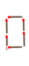
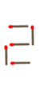
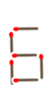
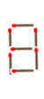
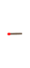

# Match-Bo

## Overview

Auto solver for **「マッチ一本だけ動かして、正しい式にしてください」**

https://dotnsf.github.io/matchbo

## How to play

- Input incorrect formula, and submit it.

- You will find corrected formulas, if exists.

## Rule

Based on [BS8 **クイズ!脳ベル SHOW**](https://www.bsfuji.tv/noubellshow/), you need to alter **valid** formula after you move **single** match.

You can **NOT** use &#x2260;("not-equal") symbol. You can use only following numbers and symbols in your answer.

You can check AI-generated quizs at https://dotnsf.github.io/matchbo?alpha=1

You can customize minor rules at https://dotnsf.github.io/matchbo?beta=1

You can check **daily** quizs at https://dotnsf.github.io/matchbo?gamma=1

### Numbers

### Symbols

## How to generate quizs

- `$ cd docs`

- `$ node generator [n]`

  - n: index(0-9)

## How to generate daily-quizs

- `$ cd docs`

- `$ node generator -1`

## Licensing

This code is licensed under MIT.

## Copyright

2020-2022  [K.Kimura @ Juge.Me](https://github.com/dotnsf) all rights reserved.
